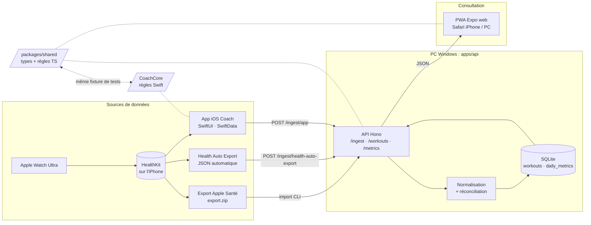
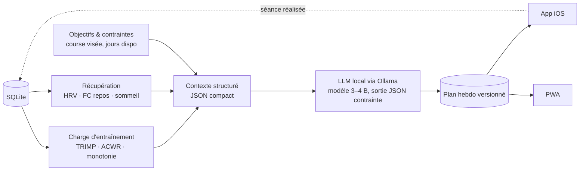

# Architecture

## Aujourd'hui

Trois idées à retenir :

1. **L'API est la source de vérité.** Tout ce qui écrit passe par elle et par la réconciliation (`reconcile.ts`).
2. **L'app iOS est autonome.** Elle applique localement les mêmes règles (`CoachCore`) pour afficher un résultat
   identique sans réseau, puis pousse vers l'API par lots. Une fixture partagée garantit que les deux implémentations
   classent pareil.
3. **Le brut est conservé.** Chaque séance garde son payload d'origine en colonne JSON : on peut recalculer sans
   réimporter.

## Demain : le coach

Direction fixée :

- **Les calculs restent déterministes et testés** (charge, tendances) ; le LLM ne fait que raisonner sur un contexte
  déjà chiffré et produire un plan au format imposé. Il ne voit jamais la base brute.
- **Le plan est une donnée comme une autre** : versionné en base, régénéré après chaque séance, comparable d'une
  version à l'autre.
- **Le LLM tourne sur le PC** (RTX 3050 Ti, 4 Go de VRAM) : modèles de 3 à 4 milliards de paramètres, quantifiés.
  Aucune donnée de santé ne quitte le réseau local.

## Couches et responsabilités

| Couche | Emplacement | Ce qu'elle fait | Ce qu'elle ne fait pas |
| --- | --- | --- | --- |
| Contrat | `packages/shared`, `CoachCore/APIContract.swift` | types, enum `Sport`, schémas zod, payloads | accès réseau ou base |
| Règles métier | `packages/shared`, `apps/api/src/db/reconcile.ts`, `CoachCore` | classification, trail, doublons, routine, formats | interface |
| Persistance | `apps/api/src/db`, `apps/ios/Coach/Models` | SQLite via drizzle ; SwiftData | logique métier |
| Ingestion | `apps/api/src/import` | parseurs XML / JSON tolérants, dates et unités Apple | décisions métier (déléguées aux règles) |
| Interface | `apps/mobile`, `apps/ios/Coach/Features` | affichage, navigation, réglages | calculs (délégués à shared / CoachCore) |
